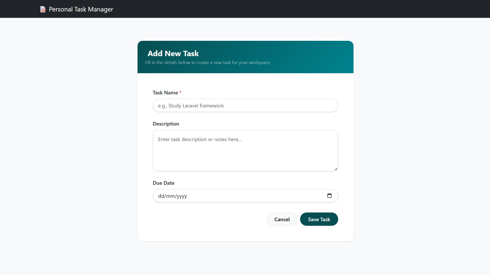
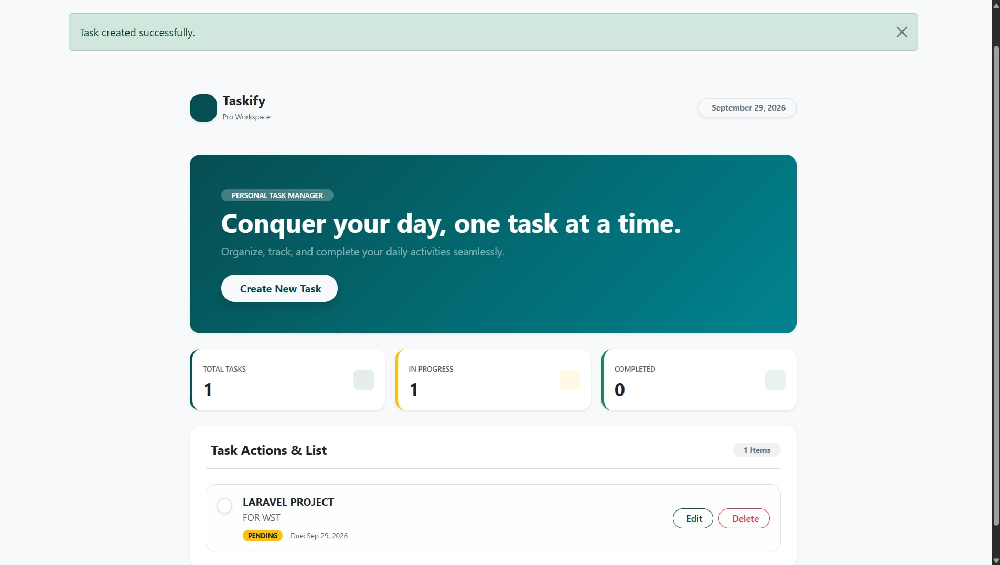
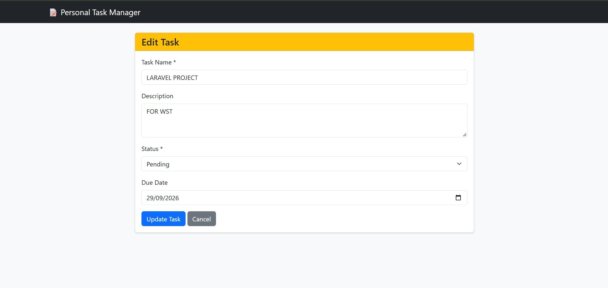
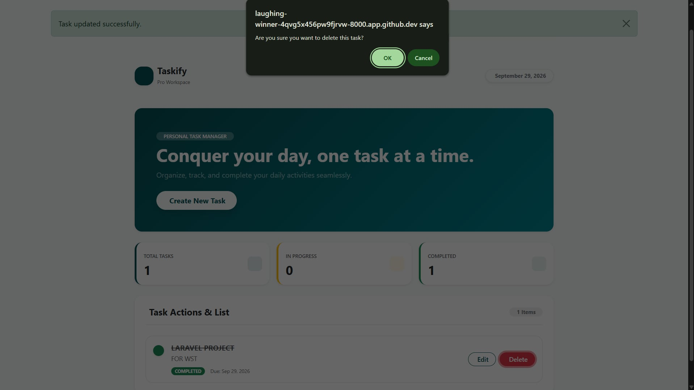
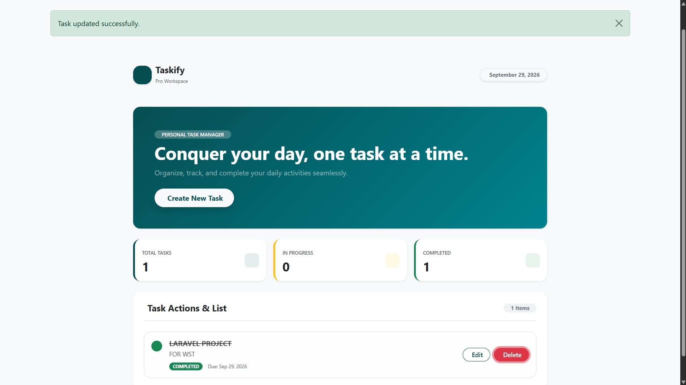

# Personal Task Manager

**Project Code:** WST21-PM-2026-SF  

**Student Name:** Abarco Walter  

**Course & Year:** BSIT 2nd Year  

**Database Used:** MySQL  

## Features

- **Add Task**

  

- **View Tasks**

  

- **Edit Task**

  

- **Delete Task**

  

- **Update Status**

  

